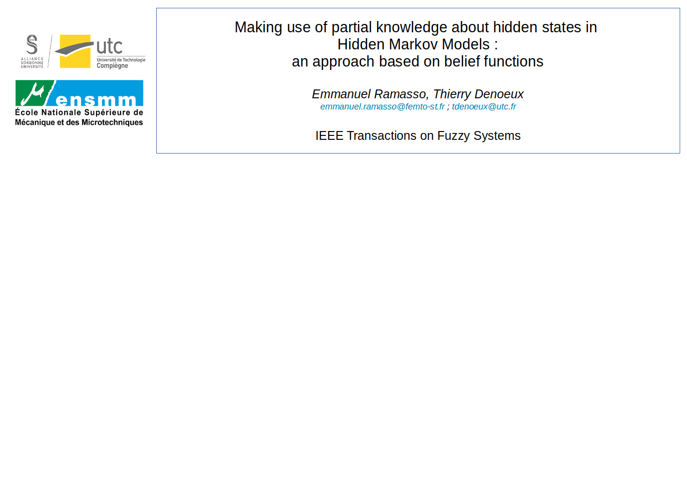
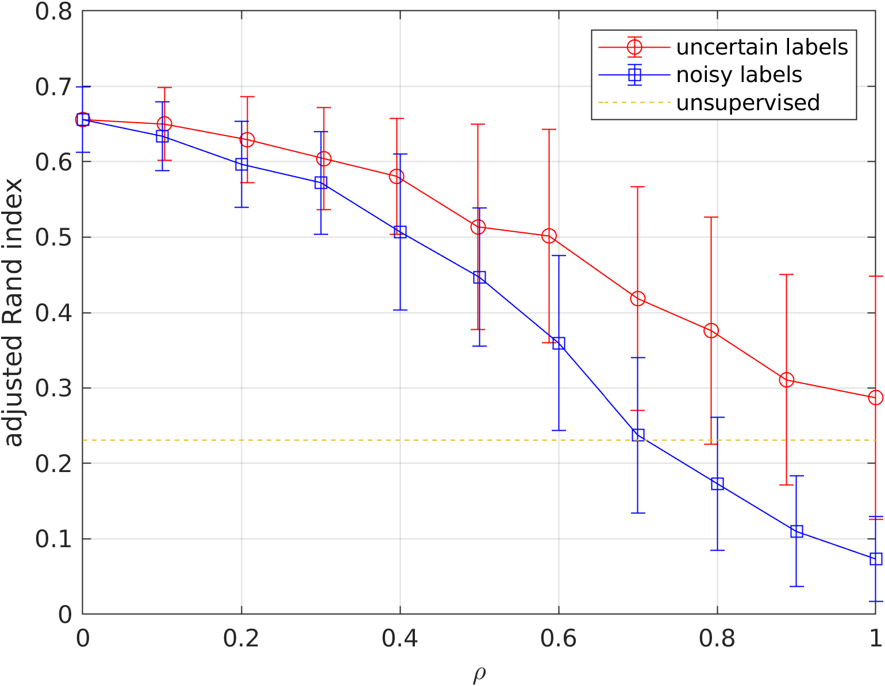
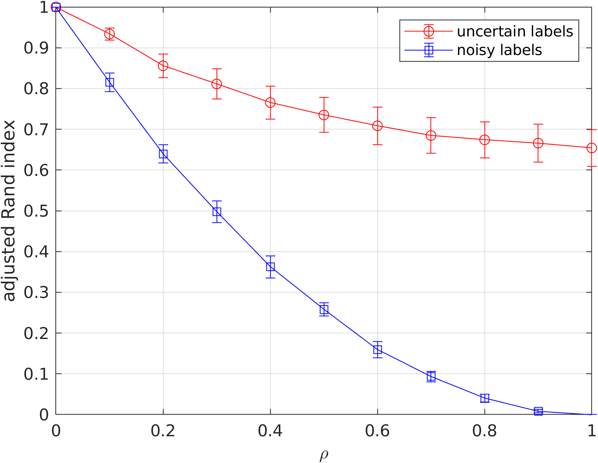

This is the implementation of [1], that is a partially hidden Markov model (P-HMM). 
Partially hidden, partially supervised, weakly hidden, weakly supervised, weak prior, soft labels, noisy labels, uncertain and imprecise labels, etc focus on taking account of a prior on the latent space, here for an HMM. 

The code provided allows to reproduce the results of the paper (see figures below). 




## Getting Started

`addpath utils/` and run 
1. `example_1_simple.m`: to run a simple example.
2. `example_2_figuresPaper.m`: to reproduce the figures.

## Cite

If you make use of this code in your work, please refer to [1]:

```
@article{PḦMM,
  title={Making use of partial knowledge about hidden states in HMMs: an approach based on belief functions},
  author={Ramasso, Emmanuel and Denoeux, Thierry},
  journal={IEEE Transactions on Fuzzy Systems},
  volume={22},
  number={2},
  pages={395--405},
  year={2013},
  publisher={IEEE}
}
```